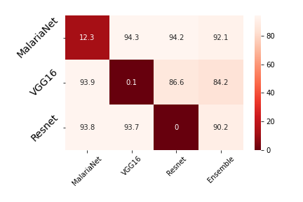

# Adversarially Robust Model for Malaria Detection

This repository utilizes an ensemble of three Convolutional Neural Networks to predict whether or not a histopathological image of a cell is malarial. The diversity of the individual models provides a layer of defense against adversarial attacks using the FGSM technique. The dataset used for this study is a collection of 27588 segmented cell images acquired at Chittagong Medical College Hospital, Bangladesh. Additional details about the dataset can be found [here](https://lhncbc.nlm.nih.gov/LHC-downloads/downloads.html#malaria-datasets)

## Description

Three models, as described below, were trained on the Malarial Cell Images dataset. The models were then combined into an ensemble to provide a layer of defense against adversarial attacks. The models were trained using the Adam optimizer with a learning rate of 0.001. The models were trained for 10 epochs with a batch size of 32. The models were trained on a Kaggle Notebook GPU.

1. Model 1: A simple 3-layered CNN with shown in Figure 1. This model will be refered to as "MalariaNet" in future references.
2. Model 2: A resnet50 model with the last layer removed and replaced with a fully connected layer with 2 outputs. This model will be refered to as "ResNet50" in future references.
3. Model 3: A VGG16 model with the last layer removed and replaced with a fully connected layer with 2 outputs. This model will be refered to as "VGG16" in future references.

## Experiments & Results

### Experiment 1: Robustness to Noise

We test the robustness of each of the models to random speckle noise. Speckle noise is defined mathematically as:
$$\mathbf{N} = \mathbf{I} + \mathbf{I} \cdot \mathbf{G}$$
where $\mathbf{I}$ is the original image, $\mathbf{G}$ is a matrix of values from a Gaussian distribution, and $\mathbf{N}$ is the noisy image. We vary the standard deviation of the Gaussian in the above expression increments and the resulting noisy images are passed through one model at a time and the confidence value for class 'Parasitic' is recorded. This is averaged over ~250 images. The results are shown in Figure 2.

*Figure 2: Model Predictions on a Speckle Noise Corrupted Uninfected Image. y-axis represents the probability of the model predicting the image to be parasitic. The x-axis represents the standard deviation of the Gaussian distribution used to generate the speckle noise*

## Experiment 2: Robustness to Adversarial Attacks

Adversarial attacks are a class of attacks that are designed to fool a machine learning model into misclassifying an image. These attacks are designed to be imperceptible to the human eye. The FGSM attack is a simple attack that is based on the gradient of the loss function with respect to the input image. The FGSM attack is defined mathematically as:
$$\mathbf{X} = \mathbf{X} + \epsilon \cdot sign(\nabla_{\mathbf{X}} J(\mathbf{X}, \mathbf{y}))$$
where $\mathbf{X}$ is the original image, $\mathbf{y}$ is the true label of the image, $\epsilon$ is the perturbation size, and $J$ is the loss function. For each model, we obtain an 'adversarial' dataset which is designed to fool that model into misclassifying the image. These datasets will be referred to as $D_{Resnet50}$, $D_{VGG16}$, and $D_{MalariaNet}$ where the subscript denotes the model that the dataset is designed to fool.
Figure 3. We then evaluate all three models on the adversarial dataset and record the accuracy. Thus, three models are evaluated on three datasets each. The results are shown in Figure 3. The results show that the ensemble of models is more robust to adversarial attacks than any individual model.

*Figure 3: Accuracy of the three models on the original dataset and the adversarial datasets. The models on the vertical axis are the attacked models and the models on the horizontal axis are the models on which evaluation is performed. For example, the cell in the first row and second column represents the accuracy of VGG16 on the adversarial dataset generated by an adversarial (FGSM) attack on MalariaNet.*
Model E denotes the ensemble model.

## Experiment 3: Cosine Similarity between Adversarial Directions

Given a model $M$ and an image $I$, the adversarial direction $D$ is defined as:
$$D = sign(\nabla_{\mathbf{X}} J(\mathbf{X}, \mathbf{y}))$$
where $\mathbf{X}$ is the original image, $\mathbf{y}$ is the true label of the image, and $J$ is the loss function. That is, the adversarial direction is the direction in which the loss function increases the most. If the adversarial directions for two different models $M_1$ and $M_2$ are similar, it indicates that both the models can be fooled by perturbing the image in the same direction. Hence, as an indicator of the robustness of a model, we calculate the cosine similarity (normalized dot product) between the adversarial directions of the three models. For each image in the dataset, we calculate the adversarial direction for each of the three models. We then calculate the cosine similarity between each pair of adversarial directions and average the results over all images in the dataset, obtaining a single value for each pair of models.

The cosine similarity between the adversarial directions of the three models is shown in Figure 4. The results show that the cosine similarity between the adversarial directions of the three models is very low. This indicates that the three models do not have similar adversarial directions and thus the ensemble model is more robust to adversarial attacks.

| Model 1 | Model 2 | RMS Cosine Similarity | Max Cosine Similarity |
|---------|---------|---------| ---------|
| MalariaNet  | VGG16  | $3.69 \times 10^{-2}$ | $9.4 \times 10^{-2}$ |
| VGG16  | ResNet50 | $5.7 \times 10^{-2}$  | $12.5 \times 10^{-2}$ |
| ResNet50  | MalariaNet  | $1.44 \times 10^{-2}$  | $3.9 \times 10^{-2}$ |

*Table 1: Cosine Similarity between the adversarial directions of the three models.*

As can be observed from the table, the cosine similarity between the adversarial directions is slightly higher for the VGG16 and ResNet50 models. This is likely due to the fact that both the models have been pre-trained on the same dataset (ImageNet). This is also reflected in the fact that the performance of VGG16 on $D_{ResNet50}$ is and the performance of ResNet50 on $D_{VGG16}$ is slightly lower than the other values in the table.

## Usage

1. Clone the repository : `git clone  https://github.com/sanjeevg15/malaria-detection.git`
2. To train a model, run : `python train.py -root_dir <path to dataset> -model_name <name of model> -epochs <number of epochs> -batch_size <batch size> -lr <learning rate>`
